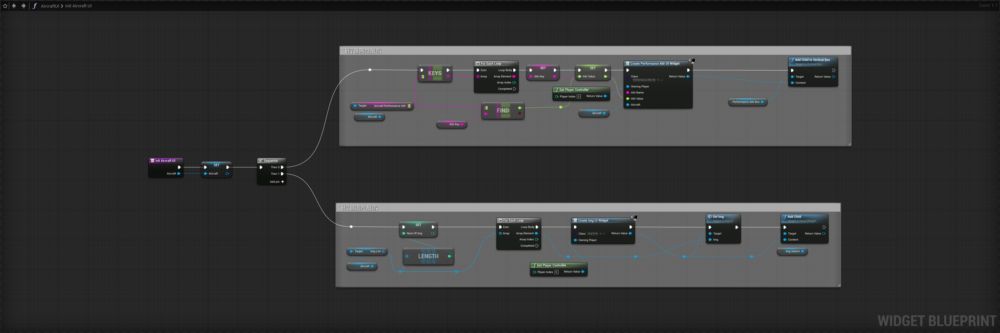

# AircraftUI

在此UI中添加如下控件，控件的具体细节请参考项目文件`WidgetBlueprint'/Game/UI/AircraftUI.AircraftUI'`

<figure><figcaption></figcaption></figure>

切换到Graph视图，添加以下几个变量，并将新添加的变量的`InstanceEditable`和`ExposeonSpawn`打开


Aircraft：缓存当前选择的飞机

AttrKey：属性的Key

AttrValue：属性的数值

NumOfImg：图片的数量

Index：当前选择图片的索引

Name：当前选择飞机的名字


<figure><figcaption></figcaption></figure>

切换到Graph页面，创建一个名为`InitAircraftUI`得函数，并编写以下蓝图：


逻辑很简单，遍历飞机上的属性数据，并创建PerformanceAttrUI和ImgUI，并初始化对应的数据。


<figure><figcaption></figcaption></figure>
