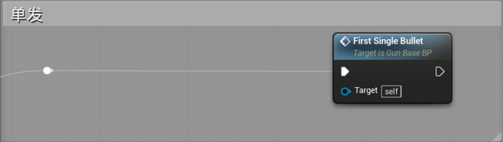

# 2.1.4 运动控制事件

为了在飞行器中实现最基本的玩家控制飞行器飞行方向的交互，我们在该组件中添加四个自定义事件，分别控制上、下、前、后四个方向的运动。创建的四个自定义事件中，为它们添加一个输入变量Axis Value（右侧Details中点击Input右方的"+"），与后面的轴映射相对应。同时添加一个输入变量Power，这里使用到了变量Power，该变量作为乘数用于设置控制力的大小，每一台飞机的Power都根据飞机型号的不同而改变，关于Power的设置将在下一节说明。

<figure><figcaption></figcaption></figure>

<figure><figcaption></figcaption></figure>

计算控制力后更新Force即可。

<figure><figcaption></figcaption></figure>

<figure><figcaption></figcaption></figure>

最后，PhysicObjComponent的Event Graph连线如图所示。

<figure><figcaption></figcaption></figure>
